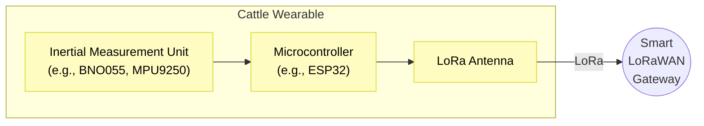
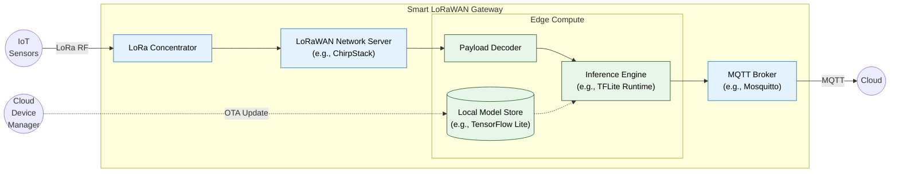
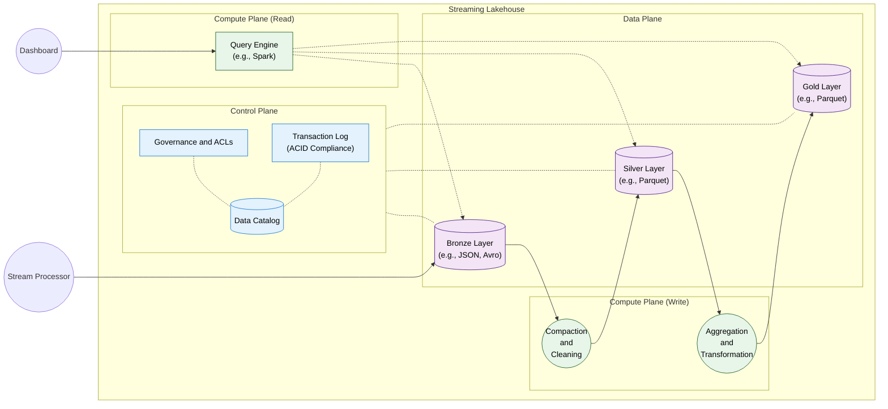

# Smart Agrifarming Pipeline Architecture

## Complete Pipeline

Pipeline diagram for Suffolk Farm's smart agrifarming system.

**This diagram does not show the connection between the IoT device manager and the gateways due to rendering constraints.** Updated models are distributed to the gateways over-the-air (OTA), a closed-loop MLOps cycle, ensuring the most recently trained models are in-use at the edge.

External data (i.e., data not collected by the farm's own sensors) can be ingested into the system via scheduled polling functions that request data via available APIs and normalise the responses into MQTT messages, entering the pipeline alongside sensor data. This ensures that minimal bespoke logic is required to make use of external sources.

```mermaid
flowchart LR
    subgraph farm["Farm"]
        subgraph edge_layer["IoT Sensors"]
            direction TB
            sensors_soil(("Soil<br>(e.g., pH,<br>moisture,<br>temperature,<br>nutrient levels)"))
            sensors_air(("Air<br>(e.g.,<br>temperature,<br>humidity,<br>CO2)"))
            sensors_cattle(("Cattle<br>(e.g., IMU,<br>GPS)"))
        end

        subgraph gateways["Gateways"]
            gateway_1(("Smart<br>LoRaWAN<br>Gateway"))
            gateway_2(("Smart<br>LoRaWAN<br>Gateway"))
        end
    end

    external_sources(("External Sources<br>(e.g., satellite imagery)"))
    external_sources -->|API| scheduled_polling
    scheduled_polling -->|"MQTT (Publish)"| broker

    subgraph cloud["Cloud"]
        subgraph ingestion["Ingestion"]
            scheduled_polling["Scheduled Polling"]
            broker["MQTT Broker"]
            stream_processor["Stream Processor<br>(e.g., Apache Flink)"]
        end

        subgraph lakehouse["Streaming Lakehouse"]
            bronze[("Bronze Data (Raw)")]
            silver[("Silver Data (Clean)")]
            gold[("Gold Data<br>(Business-Ready)")]
        end

        subgraph mlops["MLOps"]
            training["Model<br>Training"]
            registry[("Model<br>Registry")]
            device_manager["IoT<br>Device<br>Manager"]
        end

        subgraph serving["Serving"]
            dashboard["Dashboards"]
            api["API Gateway<br>(e.g., notifications)"]
        end
    end

    sensors_soil & sensors_air -->|LoRa| gateway_1
    sensors_cattle -->|LoRa| gateway_2
    gateway_1 --->|"MQTT (Publish)"| broker
    gateway_2 --->|"MQTT (Publish)"| broker
    broker -->|"MQTT (Subscribe)"| stream_processor
    stream_processor --> bronze
    stream_processor --> api
    bronze --> silver
    silver --> gold
    gold --> dashboard
    silver --> training
    training -->|"New Model"| registry
    registry -->|"Deploy"| device_manager

    classDef sensorStyle fill:#fffcc2,stroke:#dad734,color:#000
    classDef gatewayStyle fill:#e3f2fd,stroke:#1976d2,color:#000
    classDef ingestStyle fill:#fff3e0,stroke:#f57c00,color:#000
    classDef dataStyle fill:#f3e5f5,stroke:#4a148c,color:#000
    classDef mlStyle fill:#ffebee,stroke:#b71c1c,color:#000
    classDef presentationStyle fill:#fce4ec,stroke:#c2185b,color:#000

    class sensors_soil,sensors_air,sensors_cattle,external_sources sensorStyle
    class gateway_1,gateway_2 gatewayStyle
    class broker,stream_processor,scheduled_polling ingestStyle
    class bronze,silver,gold dataStyle
    class training,registry,device_manager mlStyle
    class dashboard,api presentationStyle
```

### Compute-Capable IoT Sensors

Some sensors generate more data than LoRaWAN can realistically handle. This issue can be solved by performing some of the data transformation on the wearable.

For example, IMU sensors generate datapoints at 10Hz (10 records per second). LoRaWAN's bandwidth limitations necessitate on-board processing to reduce or batch the data being transmitted. Deploying even a small model onto the wearable is unrealistic due to their large size compared with the available bandwidth (a 100MB model would take days to transfer to the wearable, draining the battery), but we can still perform some basic transformation, like windowing and feature engineering, to summarise the data and reduce the bandwidth required for transmission.

### Smart LoRaWAN Gateway

The smart LoRaWAN gateways provide edge processing capabilities at the expense of decrypting the LoRa transmissions on-site. In a typical "dumb" gateway (packet forwarder only), the gateway has no offline capabilities, so if the network connection is lost, the gateway is lost too. In this "smart" configuration, provided power is still provided to the gateway, edge processing and batching can continue, and when the network connection is resumed, the batched data can be published.

To overcome the bandwidth constraints of LoRaWAN, some sensors perform their own edge compute to reduce the quantity of data that needs to be transmitted. Sensors that are part of a machine learning pipeline (e.g., cattle IMUs) perform a portion of that pipeline on the wearable (e.g., windowing and feature engineering). The gateway, after ingesting this partially transformed data, runs the model inference engine (e.g., TFLite Runtime) to complete the pipeline (e.g., infer activity from cattle IMU). This inference can be used in other edge compute, like determining whether an alert is required if a specific condition is met, ultimately reducing network usage in time-critical situations. The models used by the smart gateway (e.g., TensorFlow Lite) receive updated over-the-air (OTA) in a closed-loop MLOps cycle, ensuring the latest trained models are in use.

The local MQTT broker is configured as a bridge to the broker in the cloud, enabling them to share topics. The resulting architecture becomes physically decentralised as a result.

## Streaming Lakehouse

The Streaming Lakehouse is the central storage and processing engine for Suffolk Farm. It combines the low-cost storage and flexibility of a Data Lake with the performance and ACID-compliant transactions of a Data Warehouse.

Prior to the Lakehouse is the stream processor. It acts as the primary gatekeeper, performing schema enforcement to ensure anomalous or bad data is intercepted prior to entering the Lakehouse. This bad data is redirected to a dead-letter queue (DLQ) that system engineers can use to debug and resolve problematic sensors. Resolving these problems here ensures that even the bronze tier of the Lakehouse is a trustworthy source, and that critical components like the ML pipeline are protected from anomalous data.

Within the Lakehouse exists the Data Plane consisting of three tiers: bronze, silver, and gold. These are generated via increasing levels of processing and transformation from the tier prior, optimised for their different use cases. First, the bronze tier ingests raw MQTT messages directly from the stream processor. This layer acts as the single source of truth (SSOT), preserving data in its original format for auditing or re-processing. Secondly, the silver tier contains data that is validated, filtered, and transformed into a structured format like Parquet. Due to the streaming component, the compaction step that takes place between the bronze and silver tiers runs frequently - this also helps combat the "small files problem" that would otherwise cause the query engine to slow to a crawl. This layer provides the data used by the cattle activity pipeline, where cleaned data is used for training and evaluating machine learning models. Finally, the gold tier contains the last level of aggregation and transformation. This tier consists of high-level metrics like average value over unit time, optimised for the query engine to serve the farm's dashboards and API notifications. Some of the data's granularity is lost at this tier for the sake of optimisation and abstraction, hence the ML pipeline consumes data from the previous tier.

The transformations set to take place between each tier can be modified at any time as the raw data is always retained at the bronze tier.

The Control Plane manages the metadata and transaction logs required to ensure data integrity. By utilising the Data Catalog and Access Control Lists (ACLs), sensitive information can be masked at the query engine level, and policies within the metadata ensure users see only the data relevant to their role. The Transaction Log, an immutable record of all changes, enables "time travel" capabilities, crucial for auditing, compliance, and debugging purposes. The log ensures ACID compliance, guaranteeing that data remains consistent and corruption-free.

## Cattle Activity Pipeline

Pipeline diagram associated with the cattle activity detection PoC (model.ipynb).

```mermaid
flowchart LR
    subgraph ingestion["Ingestion"]
        data_lake["Simulated Data Lake<br>(IMU CSVs)"]
        combine["Transform Data<br>(e.g., combine CSVs,<br>add activity column)"]
        cache["Simulated Data Warehouse<br>(Parquet Cache)"]
    end

    subgraph preprocessing["Preprocessing"]
        direction TB
        windowing["Windowing<br>(Sliding Window)"]
        features["Feature Engineering<br>(e.g., μ, σ, SMA, FFT)"]
        scaling["Feature Scaling"]
        test_train_split["Train/Test Split"]
        smote["Fix Class Imbalance<br>(SMOTE)"]
    end

    subgraph model["Modelling"]
        train["Train Models<br>(RFC and SVC)"]
        evaluation["Evaluation<br>(Confusion Matrix<br>and F1 Score)"]
        output["Save Models<br>(model.pkl)"]
    end

    data_lake --> combine
    combine --> cache
    cache --> windowing
    windowing --> features
    features --> test_train_split
    test_train_split -->|"Train Set"| scaling
    test_train_split -->|"Test Set"| scaling
    scaling -->|"Train Set"| smote
    smote --> train
    train --> evaluation
    scaling -->|"Test Set"| evaluation
    train --> output

    classDef dataStyle fill:#e3f2fd,stroke:#0d47a1,color:#000
    classDef processStyle fill:#e8f5e9,stroke:#1b5e20,color:#000
    classDef modelStyle fill:#f3e5f5,stroke:#7b1fa2,color:#000

    class data_lake,combine,cache dataStyle
    class windowing,features,test_train_split,smote,scaling processStyle
    class train,evaluation,output modelStyle
```

