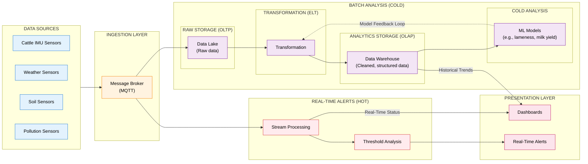

# Smart Agrifarming Pipeline Architecture

## Complete Pipeline

```mermaid
flowchart LR
    subgraph sources["DATA SOURCES"]
        direction LR
        cattle[Cattle IMU Sensors]
        weather[Weather Sensors]
        soil[Soil Sensors]
        pollution[Pollution Sensors]
    end

    subgraph ingestion["INGESTION LAYER"]
        broker["Message Broker<br>(MQTT)"]
    end

    subgraph cold_path["BATCH ANALYSIS (COLD)"]
        direction LR
        subgraph raw["RAW STORAGE (OLTP)"]
            lake["Data Lake<br>(Raw data)"]
        end

        subgraph transform["TRANSFORMATION (ELT)"]
            etl["Transformation"]
        end

        subgraph warehouse["ANALYTICS STORAGE (OLAP)"]
            dw["Data Warehouse<br>(Cleaned, structured data)"]
        end

        subgraph analytics["COLD ANALYSIS"]
            ml["ML Models<br>(e.g., lameness, milk yield)"]
        end

        lake --> etl --> dw --> ml
        ml -.->|"Model Feedback Loop"| etl
    end

    subgraph hot_path["REAL-TIME ALERTS (HOT)"]
        direction LR
        stream_proc["Stream Processing"]
        alerts["Threshold Analysis"]
    end

    subgraph presentation["PRESENTATION LAYER"]
        dash["Dashboards"]
        realtime_alert["Real-Time Alerts"]
    end

    sources --> broker
    broker --> lake
    broker --> stream_proc
    stream_proc --> alerts --> realtime_alert
    stream_proc -->|"Real-Time Status"| dash
    dw -->|"Historical Trends"|dash

    classDef sourceStyle fill:#e3f2fd,stroke:#1976d2,color:#000
    classDef ingestStyle fill:#fff3e0,stroke:#f57c00,color:#000
    classDef coldStyle fill:#f3e5f5,stroke:#7b1fa2,color:#000
    classDef hotStyle fill:#ffebee,stroke:#d32f2f,color:#000
    classDef presentStyle fill:#fce4ec,stroke:#c2185b,color:#000

    class cattle,weather,soil,pollution sourceStyle
    class broker ingestStyle
    class lake,etl,dw,ml coldStyle
    class stream_proc,alerts hotStyle
    class dash,realtime_alert presentStyle
```

## Cattle Activity Pipeline

Pipeline diagram associated with the cattle activity detection PoC (model.ipynb).

```mermaid
flowchart LR
    subgraph ingestion["Ingestion"]
        data_lake["Simulated Data Lake<br>(IMU CSVs)"]
        combine["Transform Data<br>(e.g., combine CSVs,<br>add activity column)"]
        cache["Simulated Data Warehouse<br>(Parquet Cache)"]
    end

    subgraph preprocessing["Preprocessing"]
        direction TB
        windowing["Windowing<br>(Sliding Window)"]
        features["Feature Engineering<br>(e.g., μ, σ, SMA, FFT)"]
        scaling["Feature Scaling"]
        test_train_split["Train/Test Split"]
        smote["Fix Class Imbalance<br>(SMOTE)"]
    end

    subgraph model["Modelling"]
        train["Train Models<br>(RFC and SVC)"]
        evaluation["Evaluation<br>(Confusion Matrix<br>and F1 Score)"]
        output["Save Models<br>(model.pkl)"]
    end

    data_lake --> combine
    combine --> cache
    cache --> windowing
    windowing --> features
    features --> test_train_split
    test_train_split -->|"Train Set"| scaling
    test_train_split -->|"Test Set"| scaling
    scaling -->|"Train Set"| smote
    smote --> train
    train --> evaluation
    scaling -->|"Test Set"| evaluation
    train --> output

    classDef dataStyle fill:#e3f2fd,stroke:#0d47a1,color:#000
    classDef processStyle fill:#e8f5e9,stroke:#1b5e20,color:#000
    classDef modelStyle fill:#f3e5f5,stroke:#7b1fa2,color:#000

    class data_lake,combine,cache dataStyle
    class windowing,features,test_train_split,smote,scaling processStyle
    class train,evaluation,output modelStyle
```
