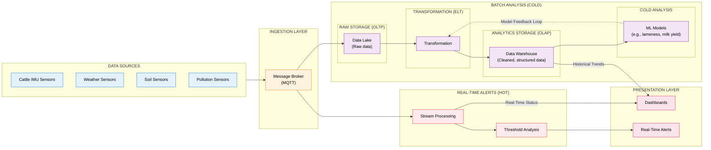
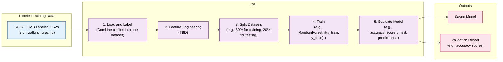

# Smart Agrifarming Pipeline Architecture

## Complete Pipeline

```mermaid
flowchart LR
    subgraph sources["DATA SOURCES"]
        cattle[Cattle IMU Sensors]
        weather[Weather Sensors]
        soil[Soil Sensors]
        pollution[Pollution Sensors]
    end

    subgraph ingestion["INGESTION LAYER"]
        broker["Message Broker<br>(MQTT)"]
    end

    subgraph cold_path["BATCH ANALYSIS (COLD)"]
        direction LR
        subgraph raw["RAW STORAGE (OLTP)"]
            lake["Data Lake<br>(Raw data)"]
        end

        subgraph transform["TRANSFORMATION (ELT)"]
            etl["Transformation"]
        end

        subgraph warehouse["ANALYTICS STORAGE (OLAP)"]
            dw["Data Warehouse<br>(Cleaned, structured data)"]
        end

        subgraph analytics["COLD ANALYSIS"]
            ml["ML Models<br>(e.g., lameness, milk yield)"]
        end

        lake --> etl --> dw --> ml
        ml -.->|"Model Feedback Loop"| etl
    end

    subgraph hot_path["REAL-TIME ALERTS (HOT)"]
        direction LR
        stream_proc["Stream Processing"]
        alerts["Threshold Analysis"]
    end

    subgraph presentation["PRESENTATION LAYER"]
        dash["Dashboards"]
        realtime_alert["Real-Time Alerts"]
    end

    sources --> broker
    broker --> lake
    broker --> stream_proc
    stream_proc --> alerts --> realtime_alert
    stream_proc -->|"Real-Time Status"| dash
    dw -->|"Historical Trends"|dash

    classDef sourceStyle fill:#e3f2fd,stroke:#1976d2,color:#000
    classDef ingestStyle fill:#fff3e0,stroke:#f57c00,color:#000
    classDef coldStyle fill:#f3e5f5,stroke:#7b1fa2,color:#000
    classDef hotStyle fill:#ffebee,stroke:#d32f2f,color:#000
    classDef presentStyle fill:#fce4ec,stroke:#c2185b,color:#000

    class cattle,weather,soil,pollution sourceStyle
    class broker ingestStyle
    class lake,etl,dw,ml coldStyle
    class stream_proc,alerts hotStyle
    class dash,realtime_alert presentStyle
```

## PoC Implementation

```mermaid
flowchart LR
    subgraph input_data["Labeled Training Data"]
        direction LR
        csvs["~450/~50MB Labeled CSVs<br>(e.g., walking, grazing)"]
    end

    subgraph jupyter["PoC"]
        direction LR
        load["1. Load and Label<br>(Combine all files into one dataset)"]
        feature_eng["2. Feature Engineering<br>(TBD)"]
        split["3. Split Datasets<br>(e.g., 80% for training, 20% for testing)"]
        model_train["4. Train<br/>(e.g., `RandomForest.fit(x_train, y_train)`)"]
        model_eval["5. Evaluate Model<br>(e.g., `accuracy_score(y_test, predictions)`)"]

        load --> feature_eng --> split --> model_train --> model_eval
    end

    subgraph output["Outputs"]
        direction LR
        model["Saved Model"]
        report["Validation Report<br>(e.g., accuracy scores)"]
    end

    csvs --> load
    model_eval --> model
    model_eval --> report

    classDef data fill:#e3f2fd,stroke:#1976d2,color:#000
    classDef process fill:#f3e5f5,stroke:#7b1fa2,color:#000
    classDef output fill:#fce4ec,stroke:#c2185b,color:#000

    class csvs data
    class load,feature_eng,split,model_train,model_eval process
    class model,report output
```
