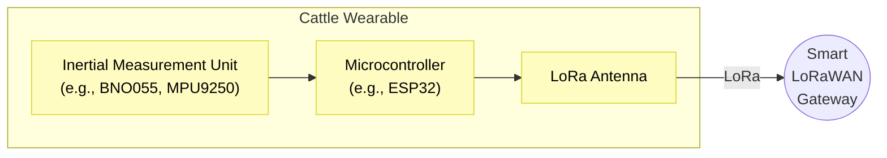
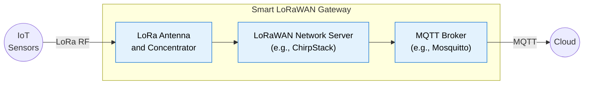

# Smart Agrifarming Pipeline Architecture

## Complete Pipeline

Pipeline diagram for Suffolk Farm's smart agrifarming system.

```mermaid
flowchart LR
    subgraph farm["Farm"]
        subgraph edge_layer["IoT Sensors"]
            direction TB
            sensors_soil(("Soil<br>(e.g., pH,<br>moisture,<br>temperature,<br>nutrient levels)"))
            sensors_air(("Air<br>(e.g.,<br>temperature,<br>humidity,<br>CO2)"))
            sensors_cattle(("Cattle<br>(e.g., IMU,<br>GPS)"))
        end

        subgraph gateways["Gateways"]
            gateway_1(("Smart<br>LoRaWAN<br>Gateway"))
            gateway_2(("Smart<br>LoRaWAN<br>Gateway"))
        end

    end

    subgraph cloud["Cloud"]
        subgraph ingestion["Ingestion"]
            broker["MQTT Broker"]
            stream_processor["Stream Processor<br>(e.g., Apache Flink)"]
        end


        subgraph lakehouse["Streaming Lakehouse"]
            bronze[("Bronze Data (Raw)")]
            silver[("Silver Data (Clean)")]
            gold[("Gold Data<br>(Business-Ready)")]
        end

        subgraph mlops["MLOps"]
            training["Model Training"]
            registry[("Model Registry")]
            device_manager["IoT Device Manager"]
        end


        subgraph serving["Serving"]
            dashboard["Dashboards"]
            api["API Gateway<br>(e.g., notifications)"]
        end
    end

    sensors_soil & sensors_air -->|LoRa| gateway_1
    sensors_cattle -->|LoRa| gateway_2
    gateway_1 -->|"MQTT (Publish)"| broker
    gateway_2 -->|"MQTT (Publish)"| broker
    broker -->|"MQTT (Subscribe)"| stream_processor
    stream_processor --> bronze
    stream_processor --> api
    bronze --> silver
    silver --> gold
    gold --> dashboard
    training --> registry
    registry --> device_manager
    silver -->|"Historical Data"| training

    classDef sensorStyle fill:#fffcc2,stroke:#dad734,color:#000
    classDef gatewayStyle fill:#e3f2fd,stroke:#1976d2,color:#000
    classDef ingestStyle fill:#fff3e0,stroke:#f57c00,color:#000
    classDef dataStyle fill:#f3e5f5,stroke:#4a148c,color:#000
    classDef mlStyle fill:#ffebee,stroke:#b71c1c,color:#000
    classDef presentationStyle fill:#fce4ec,stroke:#c2185b,color:#000

    class sensors_soil,sensors_air,sensors_cattle sensorStyle
    class gateway_1,gateway_2 gatewayStyle
    class broker,stream_processor ingestStyle
    class bronze,silver,gold dataStyle
    class training,registry,device_manager mlStyle
    class dashboard,api presentationStyle
```

### Compute-Capable IoT Sensors

Some sensors, namely the IMU sensors, generate more data than LoRaWAN can realistically handle. This issue can be solved by performing some/all of the data transformation/analysis on the wearable.

The IMU sensors generate datapoints at 10Hz (10 records per second). LoRaWAN's bandwidth limitations necessitate on-board processing to reduce or batch the data being transmitted. One option is to deploy a model onto the wearable itself, either by training a small model (e.g., TinyML) or by optimising a larger one (e.g., TensorFlow converted to TensorFlow Lite), such that only the activity classification is transmitted (see PoC). Alternatively, the windowing process (see PoC) could be performed on the wearable such that only a summary needs to be transmitted over LoRa.

### Smart LoRaWAN Gateway

The smart LoRaWAN gateways provide edge processing capabilities at the expense of decrypting the LoRa transmissions on-site. In a typical "dumb" gateway (packet forwarder only), the gateway has no offline capabilities, so if the network connection is lost, the gateway is lost too. In this "smart" configuration, provided power is still provided to the gateway, edge processing and batching can continue, and when the network connection is resumed, the batched data can be published.

The local MQTT broker is configured as a bridge to the broker in the cloud, enabling them to share topics. The resulting architecture becomes physically decentralised as a result.

## Cattle Activity Pipeline

Pipeline diagram associated with the cattle activity detection PoC (model.ipynb).

```mermaid
flowchart LR
    subgraph ingestion["Ingestion"]
        data_lake["Simulated Data Lake<br>(IMU CSVs)"]
        combine["Transform Data<br>(e.g., combine CSVs,<br>add activity column)"]
        cache["Simulated Data Warehouse<br>(Parquet Cache)"]
    end

    subgraph preprocessing["Preprocessing"]
        direction TB
        windowing["Windowing<br>(Sliding Window)"]
        features["Feature Engineering<br>(e.g., μ, σ, SMA, FFT)"]
        scaling["Feature Scaling"]
        test_train_split["Train/Test Split"]
        smote["Fix Class Imbalance<br>(SMOTE)"]
    end

    subgraph model["Modelling"]
        train["Train Models<br>(RFC and SVC)"]
        evaluation["Evaluation<br>(Confusion Matrix<br>and F1 Score)"]
        output["Save Models<br>(model.pkl)"]
    end

    data_lake --> combine
    combine --> cache
    cache --> windowing
    windowing --> features
    features --> test_train_split
    test_train_split -->|"Train Set"| scaling
    test_train_split -->|"Test Set"| scaling
    scaling -->|"Train Set"| smote
    smote --> train
    train --> evaluation
    scaling -->|"Test Set"| evaluation
    train --> output

    classDef dataStyle fill:#e3f2fd,stroke:#0d47a1,color:#000
    classDef processStyle fill:#e8f5e9,stroke:#1b5e20,color:#000
    classDef modelStyle fill:#f3e5f5,stroke:#7b1fa2,color:#000

    class data_lake,combine,cache dataStyle
    class windowing,features,test_train_split,smote,scaling processStyle
    class train,evaluation,output modelStyle
```

