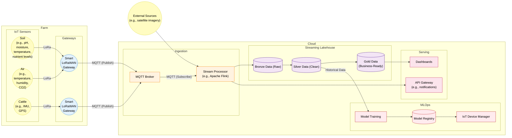
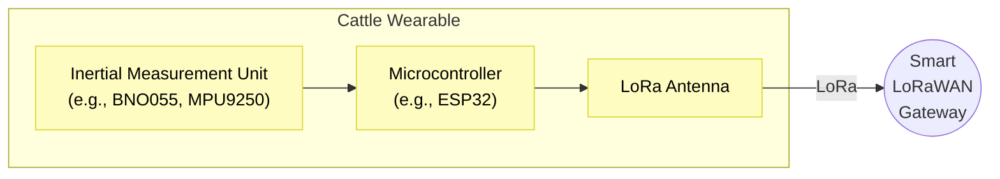
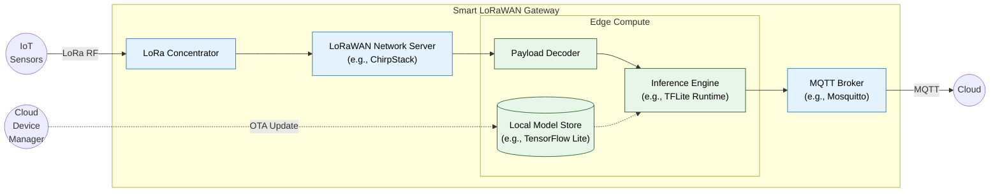

# Smart Agrifarming Pipeline Architecture

## Complete Pipeline

Pipeline diagram for Suffolk Farm's smart agrifarming system.

**This diagram does not show the connection between the IoT device manager and the gateways due to rendering constraints.** Updated models are distributed to the gateways over-the-air (OTA), a closed-loop MLOps cycle, ensuring the most recently trained models are in-use at the edge.

### Compute-Capable IoT Sensors

Some sensors generate more data than LoRaWAN can realistically handle. This issue can be solved by performing some of the data transformation on the wearable.

For example, IMU sensors generate datapoints at 10Hz (10 records per second). LoRaWAN's bandwidth limitations necessitate on-board processing to reduce or batch the data being transmitted. Deploying even a small model onto the wearable is unrealistic due to their large size compared with the available bandwidth (a 100MB model would take days to transfer to the wearable, draining the battery), but we can still perform some basic transformation, like windowing and feature engineering, to summarise the data and reduce the bandwidth required for transmission.

### Smart LoRaWAN Gateway

The smart LoRaWAN gateways provide edge processing capabilities at the expense of decrypting the LoRa transmissions on-site. In a typical "dumb" gateway (packet forwarder only), the gateway has no offline capabilities, so if the network connection is lost, the gateway is lost too. In this "smart" configuration, provided power is still provided to the gateway, edge processing and batching can continue, and when the network connection is resumed, the batched data can be published.

To overcome the bandwidth constraints of LoRaWAN, some sensors perform their own edge compute to reduce the quantity of data that needs to be transmitted. Sensors that are part of a machine learning pipeline (e.g., cattle IMUs) perform a portion of that pipeline on the wearable (e.g., windowing and feature engineering). The gateway, after ingesting this partially transformed data, runs the model inference engine (e.g., TFLite Runtime) to complete the pipeline (e.g., infer activity from cattle IMU). This inference can be used in other edge compute, like determining whether an alert is required if a specific condition is met, ultimately reducing network usage in time-critical situations. The models used by the smart gateway (e.g., TensorFlow Lite) receive updated over-the-air (OTA) in a closed-loop MLOps cycle, ensuring the latest trained models are in use.

The local MQTT broker is configured as a bridge to the broker in the cloud, enabling them to share topics. The resulting architecture becomes physically decentralised as a result.

## Cattle Activity Pipeline

Pipeline diagram associated with the cattle activity detection PoC (model.ipynb).

```mermaid
flowchart LR
    subgraph ingestion["Ingestion"]
        data_lake["Simulated Data Lake<br>(IMU CSVs)"]
        combine["Transform Data<br>(e.g., combine CSVs,<br>add activity column)"]
        cache["Simulated Data Warehouse<br>(Parquet Cache)"]
    end

    subgraph preprocessing["Preprocessing"]
        direction TB
        windowing["Windowing<br>(Sliding Window)"]
        features["Feature Engineering<br>(e.g., μ, σ, SMA, FFT)"]
        scaling["Feature Scaling"]
        test_train_split["Train/Test Split"]
        smote["Fix Class Imbalance<br>(SMOTE)"]
    end

    subgraph model["Modelling"]
        train["Train Models<br>(RFC and SVC)"]
        evaluation["Evaluation<br>(Confusion Matrix<br>and F1 Score)"]
        output["Save Models<br>(model.pkl)"]
    end

    data_lake --> combine
    combine --> cache
    cache --> windowing
    windowing --> features
    features --> test_train_split
    test_train_split -->|"Train Set"| scaling
    test_train_split -->|"Test Set"| scaling
    scaling -->|"Train Set"| smote
    smote --> train
    train --> evaluation
    scaling -->|"Test Set"| evaluation
    train --> output

    classDef dataStyle fill:#e3f2fd,stroke:#0d47a1,color:#000
    classDef processStyle fill:#e8f5e9,stroke:#1b5e20,color:#000
    classDef modelStyle fill:#f3e5f5,stroke:#7b1fa2,color:#000

    class data_lake,combine,cache dataStyle
    class windowing,features,test_train_split,smote,scaling processStyle
    class train,evaluation,output modelStyle
```

